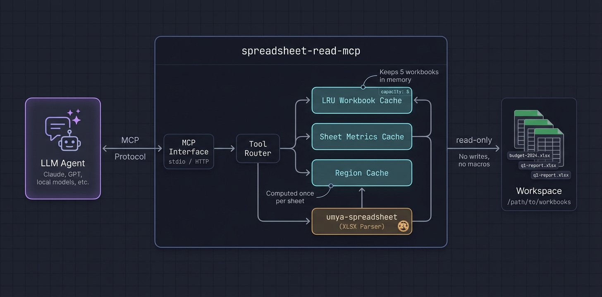
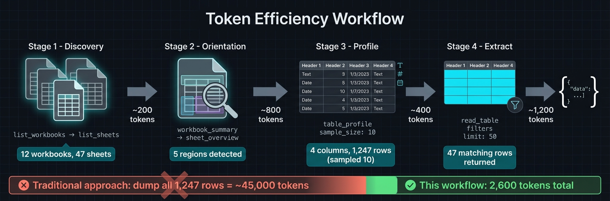
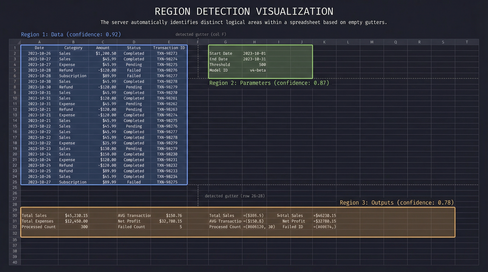

# Spreadsheet Read MCP

[](https://crates.io/crates/spreadsheet-read-mcp)
[](https://docs.rs/spreadsheet-read-mcp)
[](https://github.com/PSU3D0/spreadsheet-read-mcp/blob/main/LICENSE)


Read-only MCP server for spreadsheet analysis. Slim, token-efficient tool surface designed for LLM agents.

## Why?

Dumping a 50,000-row spreadsheet into an LLM context is expensive and usually unnecessary. Most spreadsheet tasks need surgical access: find a region, profile its structure, read a filtered slice. This server exposes tools that let agents **discover → profile → extract** without burning tokens on cells they don't need.

- **Full support:** `.xlsx` (via `umya-spreadsheet`)
- **Discovery only:** `.xls`, `.xlsb` (enumerated, not parsed)

## Architecture



- **LRU cache** keeps recently-accessed workbooks in memory (configurable capacity)
- **Lazy sheet metrics** computed once per sheet, reused across tools
- **Region detection** runs once and caches bounds for `sheet_overview`, `find_value`, `read_table`, `table_profile`

## Tool Surface

| Tool | Purpose |
| --- | --- |
| `list_workbooks`, `list_sheets` | Discover targets and get sheet summaries |
| `workbook_summary` | Region counts/kinds, named ranges, suggested entry points |
| `sheet_overview` | Detected regions (bounds/id/kind/confidence), narrative, key ranges |
| `find_value` | Value/label-mode lookup with region/table scoping, neighbors, row context |
| `read_table` | Structured read (range/region/table/named range), headers, filters, sampling |
| `table_profile` | Lightweight column profiling with samples and inferred types |
| `range_values` | Minimal range fetch for spot checks |
| `sheet_page` | Fallback pagination; supports `compact`/`values_only` |
| `formula_trace` | Precedents/dependents with paging |

Hidden/optional: `sheet_styles`, `sheet_statistics`, `scan_volatiles`, `get_manifest_stub`, `close_workbook`.

## Example

**Request:** Profile a detected region
```json
{
  "tool": "table_profile",
  "arguments": {
    "workbook_id": "budget-2024-a1b2c3",
    "sheet_name": "Q1 Actuals",
    "region_id": 1,
    "sample_size": 10,
    "sample_mode": "distributed"
  }
}
```

**Response:**
```json
{
  "sheet_name": "Q1 Actuals",
  "headers": ["Date", "Category", "Amount", "Notes"],
  "column_types": [
    {"name": "Date", "inferred_type": "date", "nulls": 0, "distinct": 87},
    {"name": "Category", "inferred_type": "text", "nulls": 2, "distinct": 12, "top_values": ["Payroll", "Marketing", "Infrastructure"]},
    {"name": "Amount", "inferred_type": "number", "nulls": 0, "min": 150.0, "max": 84500.0, "mean": 12847.32},
    {"name": "Notes", "inferred_type": "text", "nulls": 45, "distinct": 38}
  ],
  "row_count": 1247,
  "samples": [...]
}
```

The agent now knows column types, cardinality, and value distributions—without reading 1,247 rows.

## Recommended Agent Workflow



1. `list_workbooks` → `list_sheets` → `workbook_summary` for orientation
2. `sheet_overview` to get `detected_regions` (ids/bounds/kind/confidence)
3. `table_profile` → `read_table` with `region_id`, small `limit`, and `sample_mode` (`distributed` preferred)
4. Use `find_value` (label mode) or `range_values` for targeted pulls
5. Reserve `sheet_page` for unknown layouts or calculator inspection; prefer `compact`/`values_only`
6. Keep payloads small; page/filter rather than full-sheet reads

## Region Detection



Spreadsheets often contain multiple logical tables, parameter blocks, and output areas on a single sheet. The server detects these automatically:

1. **Gutter detection** — Scans for empty rows/columns that separate content blocks
2. **Recursive splitting** — Subdivides large areas along detected gutters
3. **Border trimming** — Removes sparse edges to tighten bounds
4. **Header detection** — Identifies header rows (including multi-row merged headers)
5. **Classification** — Labels each region: `data`, `parameters`, `outputs`, `calculator`, `metadata`
6. **Confidence scoring** — Higher scores for well-structured regions with clear headers

Regions are cached per sheet. Tools like `read_table` accept a `region_id` to scope reads without manually specifying ranges.

## Quick Start

```bash
cargo install spreadsheet-read-mcp

spreadsheet-read-mcp --workspace-root /path/to/workbooks
```

Or build from source:
```bash
cargo run --release -- --workspace-root /path/to/workbooks
```

Default transport: HTTP streaming at `127.0.0.1:8079`. Endpoint: `POST /mcp`.

Use `--transport stdio` for CLI pipelines.

## MCP Client Configuration

### Claude Desktop

Add to `claude_desktop_config.json`:
```json
{
  "mcpServers": {
    "spreadsheet": {
      "command": "spreadsheet-read-mcp",
      "args": ["--workspace-root", "/path/to/workbooks", "--transport", "stdio"]
    }
  }
}
```

### Cursor / VS Code

Add to your MCP settings:
```json
{
  "mcp.servers": {
    "spreadsheet": {
      "command": "spreadsheet-read-mcp",
      "args": ["--workspace-root", "${workspaceFolder}", "--transport", "stdio"]
    }
  }
}
```

### HTTP Mode (any client)

```bash
spreadsheet-read-mcp --workspace-root /data/spreadsheets --http-bind 0.0.0.0:8079
```

Connect via `POST http://localhost:8079/mcp`.

## Configuration

| Flag | Env | Description |
| --- | --- | --- |
| `--workspace-root <DIR>` | `SPREADSHEET_MCP_WORKSPACE` | Workspace root to scan (default: cwd) |
| `--cache-capacity <N>` | `SPREADSHEET_MCP_CACHE_CAPACITY` | Workbook cache size (default: 5) |
| `--extensions <list>` | `SPREADSHEET_MCP_EXTENSIONS` | Allowed extensions (default: `xlsx,xls,xlsb`) |
| `--workbook <FILE>` | `SPREADSHEET_MCP_WORKBOOK` | Single-workbook mode |
| `--enabled-tools <list>` | `SPREADSHEET_MCP_ENABLED_TOOLS` | Whitelist exposed tools |
| `--transport <http\|stdio>` | `SPREADSHEET_MCP_TRANSPORT` | Transport selection (default: http) |
| `--http-bind <ADDR>` | `SPREADSHEET_MCP_HTTP_BIND` | Bind address (default: `127.0.0.1:8079`) |

## Performance

- **LRU workbook cache** — Recently opened workbooks stay in memory; oldest evicted when capacity exceeded
- **Lazy metrics** — Sheet metrics computed on first access, cached for subsequent calls
- **Region caching** — Detection runs once per sheet; `region_id` lookups are O(1)
- **Sampling modes** — `distributed` sampling reads evenly across rows without loading everything
- **Compact formats** — `values_only` and `compact` output modes reduce response size

## Testing

```bash
cargo test
```

Covers: region detection, region-scoped tools, `read_table` edge cases (merged headers, filters, large sheets), workbook summary.

## Behavior & Limits

- Strictly read-only; no mutation, recalc, or VBA execution
- XLSX parsed fully; `.xls`/`.xlsb` discovered but not parsed
- Bounded in-memory cache honors `cache_capacity`
- Prefer region-scoped reads and sampling for token/latency efficiency
